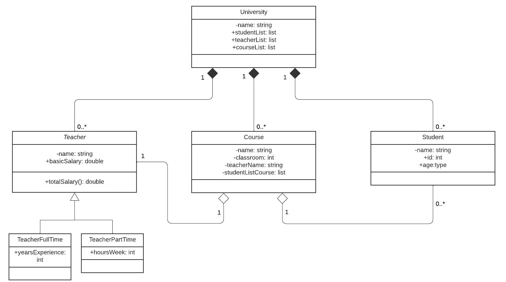

# Globant University program
> This project is a program which allows users to track university classes, teachers and students.

## Objectives

- Each Teacher has a name, and a salary calculated by the following rules:
  - For the full time teachers: base salary (attribute) multiplied by 110% of its experience years.
  - For part-time teachers: base salary multiplied for its active hours per week.
- The university includes a list of teachers, a list of students and a list of classes. Each class has a name, an     assigned classroom, a list of students and a teacher. Every student has his name, id, and age.


The program should:
1. Initialize minimum 2 different teachers of each type (full time, part time).
2. Initialize minimum 6 different students
3. Initialize minimum 4 different classes including its teacher , students and other relevant data
   4. Print a menú including the following options:
   
   - a. Print all the professors with its data
   - b. Print all the classes and a submenu to select a class in order to print the class data including its    teacher and students
   - c. Create a new student and add it to an existing class
   - d. Create a new class and add an existing teacher, existing students and its relevant data
   - e. List all the classes in which a given student is included (hint: search by id)
   - f. Exit


## Table of content
* [Architecture](#architecture)
  * [UML (Unified Modeling Language)](#uml)
* [Environment](#environment)
    * [File Descriptions](#file-descriptions)
* [Bugs](#bugs)
* [Author](#author)
* [License](#license)

##  Architecture
### UML


##  Environment
This project was developed on IntelliJ IDEA 2022.2.3 (Community Edition).

### File Descriptions
- ```src/``` contains all the classes used for this project.
- ```data/``` contains base classes used for this project.
- ```University.java``` contains the class University and the basic information of each University.
- ```Course.java``` contains the class Course and the basic information of each Course.
- ```Student.java``` contains the class Student and the basic information of each Student.
- ```Teacher.java``` contains the class Teacher and the basic information of each Teacher.
- ```FullTimeTeacher.java``` contains the class FullTimeTeacher and the basic information of each Full-Time Teacher.
- ```PartTimeTeacher.java``` contains the class PartTimeTeacher and the basic information of each Part-Time Teacher.
- ```persistance/``` contains class DataInitializer for this project.
- ```DataInitializer.java``` contains the code to load the University, classes and student initial information.
- ```view/``` contains class main used for this project.
- ```Main.java``` contains the code to start execution of the Java program.

## Bugs

Only integers must be entered when options are show during the execution of the program. Otherwise, the program will finish immediately.


## Author

- Juan Camilo González <a href="https://twitter.com/juankter" target="blank"></a>
  <a href="https://bit.ly/2MBNR0t" target="blank"></a>

## License

Public Domain. No copy write protection.